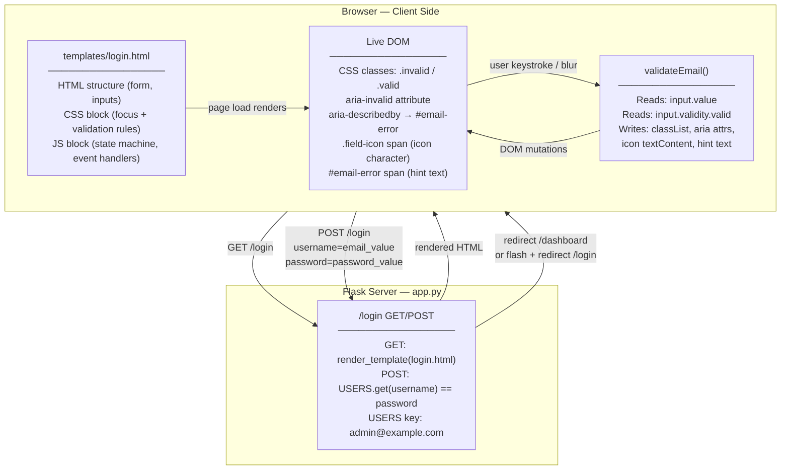
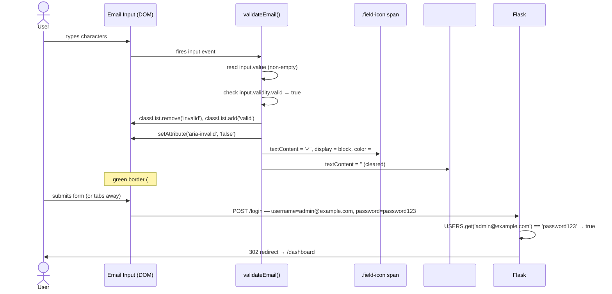
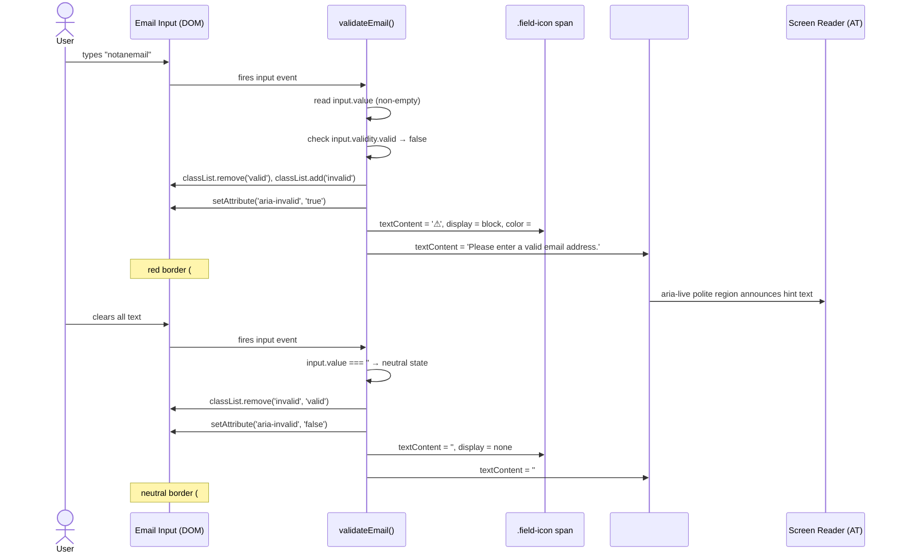
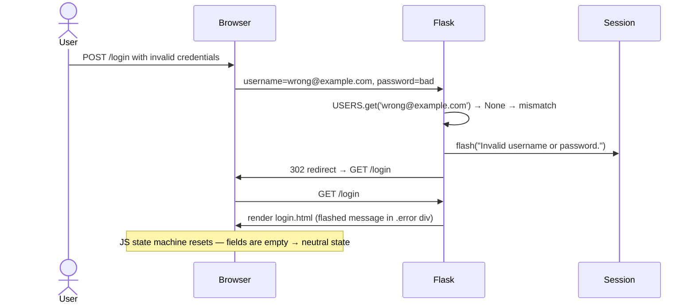

# Architecture Design
**Project:** Flask Login Application — UI Enhancement: Field-Level Visual Validation and Focus States
**Author:** Architecture Designer Agent
**Date:** 2026-07-25
**Status:** Ready for Design Review

---

## 1. Context and Drivers

### Core Business Capability

The login form must give users instant visual feedback as they type their email address, reducing submission errors and improving perceived quality before the user ever clicks the login button.

### Functional Constraints

- The email input must retain `name="username"` so the existing Flask route (`request.form.get("username")`) requires no code change (FR-002, DIR-001).
- The only permitted backend change is updating the USERS demo dict key from `"admin"` to `"admin@example.com"` in `app.py` (FR-004, DIR-002).
- All visual logic must live inside `templates/login.html` as inline CSS and inline JavaScript — no external files (NFR-010).
- Total new lines added to `login.html` must not exceed 80 (NFR-011).

### Non-Functional Constraints

| Category | Key Constraint |
|---|---|
| Performance | State transition visible within 100 ms; synchronous JS only; no async calls, timers, or network (NFR-001, NFR-002) |
| Accessibility | `aria-invalid`, `aria-describedby` on email field; icons must be `aria-hidden`; focus ring must not be suppressed (NFR-003, NFR-004, NFR-005, NFR-006) |
| Browser support | Two most recent stable releases of Chrome, Firefox, Safari, Edge (NFR-008) |
| Graceful degradation | Form remains submittable without JS; native `type="email"` browser validation is the fallback (NFR-012, A-06) |
| Security | Client-side only; no sensitive data in DOM; no XSS vectors introduced |

### Integration Boundaries

- No external APIs, databases, or third-party services. This is a pure frontend enhancement (DIR-004).
- The form POST contract to `/login` is unchanged: field `username` carries the email value.
- The Flask backend is touched in exactly one line: the USERS dict key.

---

## 2. Recommended Architecture

### Style and Rationale

**Progressive Enhancement with Inline Self-Contained Scripting.**

Given the constraints (single-file, no libraries, no external assets, max 80 new lines, graceful degradation requirement), a progressive enhancement approach is the correct fit:

1. The base HTML form works without JavaScript and without CSS enhancements.
2. The existing `<style>` block is extended with new rules that activate on new CSS classes.
3. A small inline `<script>` block at the end of `<body>` attaches event listeners and drives a three-state machine (neutral / invalid / valid) by toggling CSS classes and ARIA attributes on the email input.
4. The architecture makes no structural changes to the Flask backend routing, session management, or template rendering pipeline.

This is the narrowest change surface that satisfies every requirement and keeps the existing application intact.

---

## 3. Component Diagram



---

## 4. Data Flow

### Primary Path — User Types a Valid Email



### Exception Path — User Types an Invalid Email



### Session and Error State Path



---

## 5. Key Components and Responsibilities

### 5.1 `app.py` — Flask Backend

**Change:** One line only — USERS dict key updated from `"admin"` to `"admin@example.com"`.

**Responsibility unchanged:** Route handling for GET/POST `/login`, session creation, credential verification, flash messages, redirect to `/dashboard`, and session teardown on `/logout`. None of this logic is touched by this story.

**Why this change is sufficient:** The route reads `request.form.get("username")` and performs a dict lookup. Changing the dict key to a valid email address means the demo credential now passes both client-side email format validation (JS) and server-side credential matching, keeping the end-to-end demo workflow functional (DIR-003, AC-5).

---

### 5.2 `templates/login.html` — HTML Structure

#### Email Input Wrapper

The bare `<input>` for username is replaced with a wrapper pattern to enable icon positioning:

```
<div class="input-wrapper">
    <input
        type="email"
        id="email"
        name="username"
        placeholder="Email"
        required
        aria-describedby="email-error"
        aria-invalid="false"
    >
    <span id="email-icon" class="field-icon" aria-hidden="true"></span>
</div>
<span id="email-error" class="error-hint" role="status" aria-live="polite"></span>
```

**Why a wrapper div:** The icon span must be positioned absolutely relative to the input's visual boundary. CSS `position: absolute` requires a positioned ancestor. The input element itself cannot be that ancestor (inputs do not create a containing block for absolutely-positioned children in HTML). A `<div class="input-wrapper">` with `position: relative` is the canonical solution. This is explicitly required by FR-012 (no background-image, icon via sibling element or wrapper).

**Why a separate `<span>` for the icon vs. a pseudo-element:** CSS `::before` / `::after` pseudo-elements on `<input>` are not rendered by browsers — `<input>` is a replaced element. A sibling `<span>` inside the wrapper is the only pure-HTML approach that allows JS to set the icon character and color at runtime without toggling multiple classes.

**`aria-hidden="true"` on the icon span:** The Unicode character (⚠ or ✓) is decorative. The semantic meaning is conveyed by `aria-invalid` and the `aria-describedby` hint text. Reading the raw Unicode glyph aloud via screen reader would be redundant and confusing (NFR-006).

**`aria-live="polite"` on the error hint:** Ensures screen readers announce the hint text when it changes without interrupting currently-spoken content.

#### Password Field

The password input requires no wrapper. It uses the existing `input:focus` rule for its blue border, which already targets all `<input>` elements. No structural change.

---

### 5.3 `templates/login.html` — CSS Block

#### New Rules Added (in order of declaration — order is load-bearing)

**Rule group 1 — Wrapper and icon positioning:**

```css
.input-wrapper {
    position: relative;
    display: block;
    margin: 0.4rem 0;
}
.input-wrapper input {
    margin: 0;          /* wrapper handles vertical spacing */
    width: 100%;
    box-sizing: border-box;
}
.field-icon {
    position: absolute;
    right: 0.6rem;
    top: 50%;
    transform: translateY(-50%);
    font-size: 0.9rem;
    pointer-events: none;
    display: none;
}
```

**Rule group 2 — Focus state (applies to both fields; declared BEFORE validation rules):**

```css
input:focus {
    border-color: #1877f2;
    outline: none;
    box-shadow: 0 0 0 3px rgba(24, 119, 242, 0.2);
}
```

**Rule group 3 — Validation states (declared AFTER `:focus` so they win on equal specificity):**

```css
input.invalid {
    border-color: #d32f2f;
    padding-right: 2rem;
}
input.valid {
    border-color: #2e7d32;
    padding-right: 2rem;
}
```

**Rule group 4 — Error hint text:**

```css
.error-hint {
    display: block;
    font-size: 0.75rem;
    color: #d32f2f;
    min-height: 1em;
    margin-top: 0.15rem;
}
```

**Optional — smooth transition:**

```css
input {
    /* extend existing rule */
    transition: border-color 0.12s ease;
}
```

#### Specificity and Precedence Design

`input:focus` has CSS specificity (0, 1, 1) — one pseudo-class, one type selector.
`input.invalid` and `input.valid` also have specificity (0, 1, 1) — one class, one type selector.

When specificity is equal, the **last-declared rule wins**. The design exploits this deliberately:

- `:focus` is declared first. It provides the blue border when no validation class is active.
- `.invalid` and `.valid` are declared after `:focus`. When the user is focused on an already-validated field (both `:focus` pseudo-class and `.invalid` or `.valid` class active simultaneously), the validation border color wins because it is later in the stylesheet.

This satisfies FR-007: "validation-state border color takes precedence" over focus blue when both are active.

**Intentional dual visual signal:** When the email input is focused and simultaneously carries the `.invalid` or `.valid` class, the element displays both a validation-colored border (red or green, from the later-declared rule) and the blue `box-shadow` ring (from `input:focus`). This dual appearance is intentional and must not be "corrected" by future developers. The box-shadow ring is the accessible keyboard focus indicator required by NFR-005; removing it to make the UI look "cleaner" would break keyboard-only navigation. The validation border and the focus shadow carry independent semantic meaning and co-exist by design.

**Padding-right on validation states:** `padding-right: 2rem` on `.invalid` and `.valid` pushes typed text to the left so it does not overlap the icon. This is not applied in the neutral state to avoid layout shift on untouched fields.

---

### 5.4 `templates/login.html` — JavaScript Block

#### State Machine

```
           input event              input event
           value === ''             value !== '' &&
                                    validity.valid === false
    ┌──────────────────┐   ─────────────────────────────────────►  ┌─────────┐
    │                  │                                            │         │
    │    NEUTRAL       │◄──────────────────────────────────────────│ INVALID │
    │ (no class, gray) │   input event, value === ''               │ (.invalid│
    │                  │                                            │  class) │
    └──────────────────┘                                            └────┬────┘
            │                                                            │
            │  input event, value !== '' && validity.valid === false     │ input event,
            │                                                            │ value !== '' &&
            ▼                                                            │ validity.valid === true
    ┌──────────────────┐                                                 │
    │                  │                                                 │
    │     VALID        │◄────────────────────────────────────────────────┘
    │  (.valid class,  │
    │  green border)   │─── input event, value === '' ──────────────► NEUTRAL
    └──────────────────┘
```

All three states are reachable from any other state on a single `input` or `blur` event.

#### Event Listener Attachment

```javascript
const emailInput = document.getElementById('email');
const emailIcon  = document.getElementById('email-icon');  // id-based; immune to sibling reordering
const emailError = document.getElementById('email-error');

// Null guard: if template rendering fails and the element is absent,
// skip listener attachment rather than throwing and blocking the page.
if (emailInput) {
    emailInput.addEventListener('input', validateEmail);
    emailInput.addEventListener('blur',  validateEmail);
}
```

The `blur` event ensures users who paste a valid or invalid address in one action (without typing) receive feedback when they leave the field (A-03).

**Why `getElementById('email-icon')` instead of `querySelector('#email + .field-icon')`:** The adjacent sibling combinator would silently return `null` if any element were ever inserted between the input and the icon span in a future HTML edit. An id-based lookup is explicit, O(1), and self-documenting.

#### validateEmail Function Logic

```
function validateEmail():
    value = emailInput.value

    if value is empty string:
        → NEUTRAL: remove .invalid and .valid classes
                   set aria-invalid = "false"
                   set icon textContent = ""
                   set icon display = "none"
                   set error hint textContent = ""

    else if NOT emailInput.validity.valid:
        → INVALID: remove .valid, add .invalid
                   set aria-invalid = "true"
                   set icon textContent = "⚠"
                   set icon display = "block"
                   set icon color = "#d32f2f"
                   set error hint textContent = "Please enter a valid email address."

    else:
        → VALID:   remove .invalid, add .valid
                   set aria-invalid = "false"
                   set icon textContent = "✓"
                   set icon display = "block"
                   set icon color = "#2e7d32"
                   set error hint textContent = ""
```

#### DOM Mutations per State

| State | classList | aria-invalid | icon display | icon char | icon color | hint text |
|---|---|---|---|---|---|---|
| Neutral | (none) | `"false"` | none | — | — | `""` |
| Invalid | `.invalid` | `"true"` | block | `⚠` | `#d32f2f` | "Please enter a valid email address." |
| Valid | `.valid` | `"false"` | block | `✓` | `#2e7d32` | `""` |

All writes use `textContent` (never `innerHTML`) and `setAttribute` / `classList` — no eval, no dynamic code generation.

---

## 6. Technology Choices

### HTML5 Constraint Validation API (`input.validity.valid`) over Custom Regex

**Chosen:** `emailInput.validity.valid`

**Rationale:**
- The browser's native email validation is the exact same logic it would apply on form submit for `type="email"`. Using `validity.valid` keeps the inline JS behavior synchronized with the HTML5 native fallback (A-04, A-06, NFR-009).
- A hand-written regex that perfectly matches the browser's email parsing specification (RFC 5321 with HTML5 amendments) is complex, error-prone, and would need maintenance as browser behavior evolves.
- `validity.valid` is supported in all target browsers without a polyfill (Chrome 4+, Firefox 4+, Safari 5+, Edge 12+).
- Risk R-01 (edge-case variation across browsers for `user+tag@sub.domain` style addresses) is accepted as low-priority for this story scope.

### Inline CSS in `<style>` Block over External Stylesheet

**Chosen:** Inline `<style>` block in `login.html`

**Rationale:**
- NFR-010 prohibits external CSS frameworks or files.
- The existing template already uses an inline `<style>` block. Adding to it maintains a single-file convention that is consistent and simple to deploy.
- Keeps the entire feature self-contained in `login.html` so the feature can be reviewed, reverted, or deployed without touching the filesystem layout.

### Wrapper Div + Absolutely Positioned `<span>` for Icon over CSS Background-Image

**Chosen:** `<div class="input-wrapper">` with `<span class="field-icon" aria-hidden="true">`

**Rationale:**
- FR-012 explicitly prohibits background images (to avoid HTTP requests for icon assets).
- CSS `::after` pseudo-elements cannot be placed on `<input>` elements (inputs are replaced elements; pseudo-elements on them have no rendering effect in standard browsers).
- A sibling `<span>` inside a `position: relative` wrapper gives JS direct access to set `textContent`, `style.color`, and `style.display` at runtime — cleaner than toggling multiple CSS classes to switch icon characters.
- This approach uses zero external assets. The ⚠ and ✓ characters are Unicode code points rendered by the OS font stack.

### `novalidate` on `<form>` Tag (OQ-03 Resolution — Recommended)

**Decision: Add `novalidate` to the `<form>` element.**

**Rationale:**
- Without `novalidate`, the browser renders a native tooltip balloon when the user submits a form with an invalid `type="email"` input. This tooltip is:
  - Styled differently in every browser (inconsistent UX).
  - Not integrated with the inline icon and hint text pattern this story builds.
  - Announced differently by screen readers, creating a confusing double-announcement when `aria-invalid` is also set.
- Adding `novalidate` suppresses the native popup entirely, giving JS full ownership of validation feedback — consistent with the product decision to invest in custom inline UI.
- The `required` attribute no longer prevents submission in a `novalidate` form. Users can submit with blank fields. The server will reject the blank credential (`USERS.get("") == None`), which is the appropriate security enforcement point. Client-side validation is a UX aid, not a security gate.
- If blank-field submission prevention becomes a future requirement, a JS `submit` event handler with `preventDefault` can be added without changing this architecture.
- This resolves OQ-03 with a clear position: JS owns validation UI, server owns security enforcement.

**NFR-012 Reconciliation:** NFR-012 states "The browser's native HTML5 type='email' validation will activate on submit as a fallback." Adding `novalidate` makes that statement factually incorrect — the native browser validation popup is suppressed unconditionally by `novalidate`, regardless of whether JavaScript is enabled. This architectural decision deliberately supersedes the native-validation fallback clause in NFR-012. The actual graceful degradation backstop for no-JS environments is the server-side credential check: a user without JavaScript can still submit the form; the server will reject invalid credentials and return a flash message. The form remains submittable and functional without JS; only the inline visual enhancements and the native validation popup are absent. This is an accepted trade-off, documented here to prevent future implementers from treating the NFR-012 language as a compliance blocker against `novalidate`.

### Unicode Characters for Icons over Inline SVG

**Chosen:** Unicode `⚠︎` (U+26A0 + U+FE0E text variation selector) for warning, `✓` (U+2713) for checkmark.

**Rationale:**
- Simpler to set via `textContent` in JS.
- No SVG markup overhead within the 80-line budget (NFR-011).
- If higher visual fidelity is needed in a future story, the `<span>` is already in place and can be swapped to SVG without structural change.

**Emoji rendering risk (⚠ only):** U+26A0 WARNING SIGN has an emoji presentation by default on iOS, macOS, and some Windows font stacks. Emoji glyphs are rendered as color bitmaps or color vector fonts and ignore CSS `color`, which would cause the warning icon to appear yellow/orange rather than the specified red (#d32f2f). This would break NFR-003 (non-color state indicator) on those platforms.

**Mitigation:** Append the Unicode text variation selector U+FE0E immediately after U+26A0 when setting `textContent`. This forces the monochrome text glyph instead of the emoji glyph on all affected platforms, making CSS color apply correctly:

```javascript
icon.textContent = '⚠︎';  // ⚠ + text variation selector → text presentation
```

U+2713 CHECK MARK (`✓`) does not have an emoji variant and is not subject to this issue.

---

## 7. Security and Compliance Controls

| Concern | Control |
|---|---|
| Client-side bypass | Validation is UX-only. Server-side credential check in `app.py` is the authoritative gate. No client-side code gates submission. |
| XSS via DOM writes | All JS writes use `textContent` (never `innerHTML`). `textContent` treats its argument as a plain string and never parses HTML tags, so user-typed content cannot inject script elements into the hint or icon spans. |
| Sensitive data in DOM | The icon span contains only ⚠ or ✓. The error hint contains only a static string. No session tokens, user IDs, or password data are written to the DOM by JS. |
| Eval and dynamic code | No `eval()`, `new Function()`, `setTimeout` with string argument, or dynamic script loading is used. All JS is static and synchronous. |
| aria-invalid accuracy | `aria-invalid="true"` is set only when the input actually fails format validation. It is always cleared to `"false"` on valid or neutral state. Mis-announcing valid input as invalid is avoided. |
| Password field | No validation JS runs on the password field. Its value is never inspected, logged, or reflected in the DOM by client-side code beyond the existing form POST mechanism. |
| SECRET_KEY | The Flask application already enforces `SECRET_KEY` via environment variable; this story makes no change to that mechanism. |

---

## 8. Reliability, Performance, and Observability

### Performance

- `validateEmail()` executes synchronously within the `input` / `blur` event handler. No async operations, no network calls, no timers (NFR-002).
- The function reads two DOM properties (`input.value`, `input.validity.valid`) and writes a fixed set of properties. Execution time is sub-millisecond on any modern device, well within the 100 ms budget (NFR-001).
- A `transition: border-color 0.12s ease` on the `input` rule provides a smooth visual transition without perceptible lag (permitted by NFR-001: "CSS transition of no more than 0.15s ease is permitted").

### Reliability

- If `document.getElementById('email')` returns `null` (e.g., template rendering error), the event listener attachment would throw. A defensive null-check guard should wrap the listener registration to prevent a JS error from blocking page usability.
- The password field and submit button are unaffected by any JS error in the email validation block (they are not touched by JS).
- The form remains fully usable without JS (NFR-012): with `novalidate` on the form, native browser validation is suppressed; the server-side credential check is the functional fallback for no-JS environments (see Section 6 — NFR-012 Reconciliation).

### Observability

- This is a frontend UX enhancement with no server-side logging surface for validation events. No observability infrastructure is required or changed.
- If conversion analytics are added in future, the `validateEmail` function is the natural insertion point for an analytics event on state transitions.

---

## 9. Requirement-to-Architecture Traceability

| Requirement | Architectural Control |
|---|---|
| FR-001 | `type="email"` on the username input in `login.html` |
| FR-002 | `name="username"` retained on the email input |
| FR-003 | `placeholder="Email"` on the email input |
| FR-004 | USERS dict key changed to `"admin@example.com"` in `app.py` |
| FR-005 | `input:focus { border-color: #1877f2 }` CSS rule |
| FR-006 | Same `input:focus` rule applies to password field (targets all inputs) |
| FR-007 | `.invalid` / `.valid` rules declared after `:focus`; validation color wins by source order |
| FR-008 | Focus state is pure CSS; no JS required for focus styling |
| FR-009 | `input` event listener calls `validateEmail()` on every keystroke |
| FR-010 | `input.classList.add('invalid')` → `border-color: #d32f2f` via CSS |
| FR-011 | Icon `<span>` inside wrapper, absolutely positioned at right edge |
| FR-012 | Icon is a `<span>` with Unicode character; no HTTP request needed |
| FR-013 | `setAttribute('aria-invalid', 'true')` in invalid state |
| FR-014 | `#email-error` span with `aria-describedby` on email input; `aria-live="polite"` for announcements |
| FR-015 | `classList.remove('invalid')`, `classList.add('valid')` removes red styles immediately on valid |
| FR-016 | `.valid { border-color: #2e7d32 }` CSS rule |
| FR-017 | Icon span `textContent = '✓'`, `color = #2e7d32` in valid state |
| FR-018 | `setAttribute('aria-invalid', 'false')` and `errorHint.textContent = ''` in valid state |
| FR-019 | Empty value check → neutral state; no `.invalid` or `.valid` class active |
| FR-020 | `input` event fires on each character deletion; neutral state re-entered when value is `""` |
| FR-021 | Password input uses `input:focus` CSS rule only; no JS validation attached |
| NFR-001 | Synchronous JS; CSS transition ≤ 0.12s; no async overhead |
| NFR-002 | No async calls, timers, or network requests in `validateEmail()` |
| NFR-003 | Icon (not just color) distinguishes invalid from valid from neutral |
| NFR-004 | `aria-invalid` + `aria-describedby` on email field |
| NFR-005 | `input:focus` provides visible focus ring; `outline: none` replaced by `box-shadow` focus ring |
| NFR-006 | Icon span has `aria-hidden="true"`; semantic state via `aria-invalid` + `aria-describedby` |
| NFR-007 | `#1877f2` focus blue: 4.5:1 contrast on white; `#d32f2f` red: 5.9:1; `#2e7d32` green: 5.1:1 — all exceed 3:1 WCAG SC 1.4.11 |
| NFR-008 | Constraint Validation API, CSS, and Unicode icons all supported in target browsers |
| NFR-009 | `input.validity.valid` is the email check; no polyfill required |
| NFR-010 | All code inline in `login.html`; no external files |
| NFR-011 | ~80 lines budget: wrapper div (5), icon span (1), error hint (1), aria attrs (3), focus CSS (4), validation CSS (8), icon CSS (6), hint CSS (3), JS block (40) = ~71 lines |
| NFR-012 | `novalidate` on form; form remains submittable; `required` retained for semantic correctness |
| DIR-001 | `name="username"` on email input unchanged |
| DIR-002 | No backend route changes; only USERS dict key updated |
| DIR-003 | `admin@example.com` / `password123` demo credential documented |
| DIR-004 | No external integrations |

---

## 10. Risks and Open Questions

### Risks

| ID | Risk | Likelihood | Mitigation |
|---|---|---|---|
| R-01 | `input.validity.valid` behavior varies across browsers for edge-case addresses (e.g., `user+tag@sub.domain`). If the product requires strict or permissive control over accepted formats, a custom regex must replace the API call. | Low | Accept for this story scope. Document as a future enhancement trigger if specific edge-case complaints arise. |
| R-02 | Absolutely-positioned icon may misalign on viewports narrower than the 300 px login box (e.g., very small feature phones). The `right: 0.6rem` positioning could overlap text on narrow screens. | Medium | Test on 320 px viewport width. If overlap occurs, apply a media query to reduce `padding-right` on `.invalid`/`.valid` or hide the icon below a breakpoint. |
| R-NEW-01 | U+26A0 WARNING SIGN renders as a color emoji on iOS, macOS, and some Windows font stacks, causing CSS `color` to have no effect on the glyph. The warning icon would appear yellow/orange instead of red (#d32f2f), breaking NFR-003. | Medium | **Mitigated:** Use `'⚠︎'` (U+26A0 + U+FE0E text variation selector) when setting icon `textContent`. The text variation selector forces monochrome text presentation and makes CSS color apply. See Section 6 (Unicode Characters). |

### Open Questions — Resolved

| ID | Question | Resolution |
|---|---|---|
| OQ-01 | Should green checkmark trigger on `blur` for paste actions? | Yes. The `blur` event listener runs the same `validateEmail()` function. Paste then tab will correctly show valid state. Resolved by A-03 and the event listener design. |
| OQ-02 | Is `#1877f2` acceptable for focus borders or does design require a different shade? | `#1877f2` is recommended. It is consistent with the existing submit button brand color, provides 4.5:1 contrast on white (exceeds WCAG 3:1 requirement for SC 1.4.11), and avoids introducing a new brand color token. Resolved pending designer sign-off. |
| OQ-03 | Should native browser validation popup be suppressed in favor of inline JS validation? | **Recommended: Yes. Add `novalidate` to the `<form>` tag.** JS owns all validation feedback UI. Server-side credential check remains the security backstop. This provides consistent UX across browsers and avoids double-announcement for screen reader users. See Section 6 for full rationale. |
| OQ-04 | If staging/production environments have a separately configured USERS source, do those also need the `admin@example.com` update? | Out of scope for this story. The `app.py` change is limited to the hardcoded USERS demo dict. Credential management in other environments is an operational concern for the delivery team and does not affect this architecture. |

---

*End of Architecture Design*
